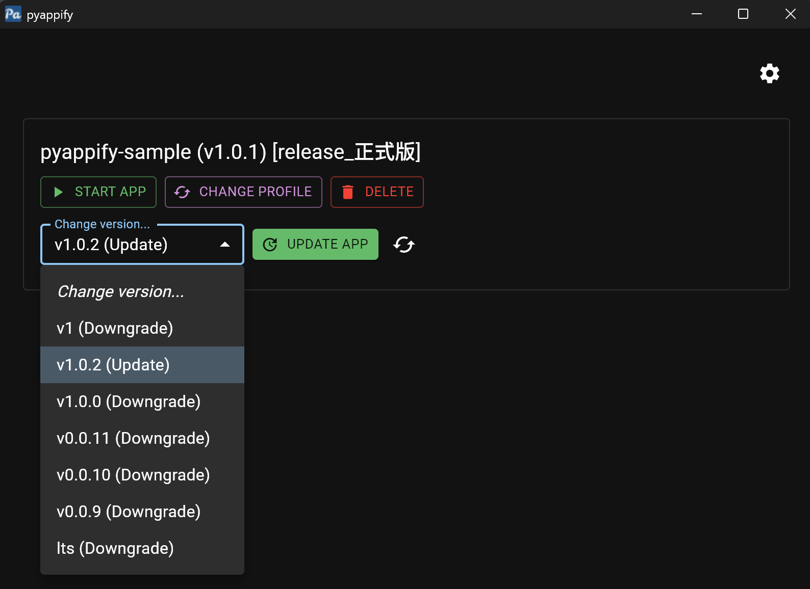

# PyAppify

A modern Python packaging tool that turns one Python project into a distributable, self-updating application, inspired by `uv`. It solves many common drawbacks found in tools like PyInstaller and Nuitka.

## Features

*   **Lightweight Launcher**: The GUI launcher is built in Rust and is only ~3MB zipped.
*   **Dynamic Setup**: On first launch, the application clones your code from a Git repository, downloads an isolated Python environment, and installs dependencies using `pip`.
*   **Universal Compatibility**: Supports all Python libraries without special configuration.
*   **Focused App Management**: Each launcher manages one embedded application, with Git- and `pip`-backed upgrades, downgrades, and auto-generated update notes.
*   **Blazing-Fast Updates**: Typical incremental take about one second.
*   **Multiple Profiles**: Define and allow users to switch between different application profiles (e.g., CPU vs. CUDA versions) with unique entry points and dependencies.
*   **CI/CD Integration**: A dedicated GitHub Action can pre-build a full package with all dependencies included for offline distribution.
*   **Aniti-Virus Friendly**: No large exe like pyinstaller which could cause the windows defender to delete, use the nsis setup packaging. 

## Quick Start: Prebuilt Launcher

This method distributes the lightweight `PyAppify` launcher. The launcher will then download your application and its dependencies on the user's machine.

1.  Download the latest `pyappify` executable from the project's [Releases page](https://github.com/ok-oldking/pyappify/releases).
2.  Modify the `pyappify.yml` file according to your python project.

```yaml
# pyappify.yml
name: "pyappify-sample" # English only
icon: "" # Optional image path relative to the app working directory, for example "assets/icon.png".
profiles:
  - name: "release" 
    git_url: "https://github.com/ok-oldking/pyappify-action.git" # The repo url to clone. Must have tags for version management; semver is recommended.
    main_script: "main.py" # If ending with .py, will use python venv to run. Otherwise, will search in the working dir and the venv's Script/bin path.
    requires_python: "3.12" # Supports python 3.7 - 3.13.
    requirements: "requirements.txt"  # Supports a requirements.txt file or pyproject.toml like .[dev,docs].
    pip_args: "--no-deps --index-url https://mirrors.cloud.tencent.com/pypi/simple" # Optional pip arguments; use --no-deps to skip dependency installation.

  - name: "debug" # Optional Another profile.
    main_script: "main_debug.py" # You can omit other properties; they will default to the values from the first profile.
    pip_args: "-i https://mirrors.aliyun.com/pypi/simple" # Optional pip arguments.
```

`pip_args` accepts arguments passed directly to `pip install`. For example, set
`pip_args: "--no-deps"` when packages listed in the requirements file should be
installed without their dependencies.

3. You can test the launcher by double-clicking the pyappify.exe and install python with the GUI. You can then package the files for offline or online distribution.

* pyappify.yml (Required, You project config.)
* pyappify.exe (You can rename it to your app name.)
* data (python, venv, dependencies, git repo, include if you want the offline full package.)
* logs(pyappify logs and your console log, auto rotate, can be deleted.)
* cache(pip cache etc, can be deleted.)

For compatibility with existing installations, application state remains under `data/apps/<app-name>/`. Other directories already present under `data/apps/` are left untouched, but the launcher loads only the application embedded in its `pyappify.yml`.


## Quick Start: Pre-packaged Release with GitHub Actions

This method uses the PyAppify GitHub Action to bundle the launcher, your code, and all dependencies into a single distributable zip file. This is ideal for users who need a fully offline installation.

### Prerequisites

1.  A `pyappify.yml` file in the root of your repository, configured for your project.
2.  (Optional) An `icons` directory in your repository root containing `icon.ico` and `icon.png` for custom application icons.

### Workflow Example

refer to the docs at [https://github.com/ok-oldking/pyappify-action](https://github.com/ok-oldking/pyappify-action)

## Startup arguments

PyAppify checks the repository for newer release tags when it starts. Manual-update mode shows a desktop notification when a newer release is available; automatic modes notify and then update before starting the application.

Automatic application startup waits 10 seconds. Turning off **Auto Start** during that window cancels the pending start.

The startup behavior can be overridden for the current launcher process without changing `app.json`:

```text
pyappify.exe -c start --auto-start true --update-method auto
```

Supported options:

* `-a, --auto-start <true|false>` temporarily overrides Auto Start. `-c start` implies `true` when this option is omitted.
* `-u, --update-method <manual|auto|auto-pre-release>` temporarily overrides the update method.
* `--update-to-version <version>` (also `--update_to_version`) starts the launcher and updates the managed application to the requested tag. If the launcher is already running, the request is forwarded to that process.

Version history is available as a headless JSON command:

```text
pyappify.exe --get-version-list --number-versions 10 --release-only true
```

`number_versions` defaults to `10`, and `release_only` defaults to `true`. Hyphenated and underscored spellings are accepted. Each returned entry contains `version`, `previous_version`, and `update_note`; the notes are the commits between that version and the preceding filtered version. Use `--release-only false` (or `--include-prerelease`) to include prerelease tags.

The equivalent environment variables are `PYAPPIFY_AUTO_START` and `PYAPPIFY_UPDATE_METHOD`. Command-line options take precedence. These overrides apply only to the current run and are never written to the saved configuration.
